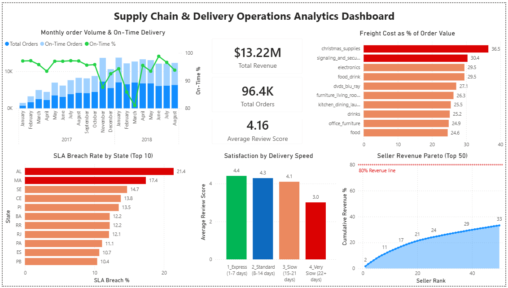

# Supply Chain & Delivery Operations Analytics
`Python` · `MySQL` · `pandas` · `matplotlib` · `Power BI` · `SLA Tracking` · `Seller Scorecard`

---

## Executive Summary

Analysed **96,443 real delivered orders (R$13.2M revenue)** from Olist — Brazil's largest e-commerce marketplace aggregator — across 27 states, 2,959 sellers, and 57 product categories using a 4-module operations analytics pipeline. Identified that **Northeast Brazil carries SLA breach rates up to 21.4%**, customer satisfaction collapses from 4.41 to 3.01 when delivery exceeds 21 days, and freight costs consume up to **36.5% of order value** in high-burden categories. Delivered 5 prioritised operational recommendations targeting SLA improvement, seller performance, and freight optimisation.

---

## The Problem

E-commerce operations teams managing large seller marketplaces have no structured view of where SLA breaches are concentrated, which sellers are chronically underperforming, which product categories carry disproportionate freight costs, and how delivery speed drives customer satisfaction. Without this, operations decisions are reactive and resources are misallocated across geographies and seller tiers.

The challenge: build an end-to-end operations analytics pipeline that joins 9 relational tables, derives delivery KPIs, scores every seller on a composite performance metric, and surfaces prioritised recommendations — replicating the analytical workflow of an Operations or Supply Chain Analyst at a logistics-driven company.

---

## Dataset

**Olist Brazilian E-Commerce** — Real commercial transaction data from Brazil's largest online marketplace aggregator (Sep 2016 – Aug 2018). All 9 tables are included in `data/`.

| File | Description | Rows |
|------|-------------|------|
| `olist_orders_dataset.csv` | Order status and delivery timestamps | 99,441 |
| `olist_order_items_dataset.csv` | Products, sellers, prices, freight per item | 112,650 |
| `olist_customers_dataset.csv` | Customer location (city, state) | 99,441 |
| `olist_sellers_dataset.csv` | Seller location | 3,095 |
| `olist_products_dataset.csv` | Product category, weight, dimensions | 32,951 |
| `olist_order_reviews_dataset.csv` | Customer review scores | 99,224 |
| `olist_order_payments_dataset.csv` | Payment type and value | 103,886 |
| `olist_geolocation_dataset.csv` | Zip code coordinates | 1,000,163 |
| `product_category_name_translation.csv` | Portuguese to English category names | 71 |

> [Download from Kaggle](https://www.kaggle.com/datasets/olistbr/brazilian-ecommerce) · Olist (2018) · CC BY-NC-SA 4.0
> Place all 9 CSV files in  before running the pipeline.

---

## The Solution — 4-Module Analytics Pipeline

```
RAW DATA (9 relational tables, 1M+ rows)
│
├── Module 1: Data Cleaning & Integration
│     Join 9 tables into unified order-level dataset
│     Parse all delivery timestamps · Filter to 96,443 delivered orders
│     Derive: delay_days, is_late, is_on_time, freight_ratio
│     Translate product categories (Portuguese to English)
│     Output: cleaned_orders.csv + seller_summary.csv
│
├── Module 2: Delivery Performance Analysis
│     Monthly on-time rate and SLA breach tracking
│     State-level delivery performance and breach ranking
│     Category-level freight burden and delivery speed analysis
│     Output: delivery_performance.csv + state_performance.csv
│             + category_performance.csv + 3 charts
│
├── Module 3: Seller Scorecard
│     Composite score: On-Time Rate (40%) + Review Score (35%) + Revenue (25%)
│     Rank all sellers and assign performance tiers (Elite / Good / Average / At Risk)
│     Output: seller_scorecard.csv + 3 charts
│
└── Module 4: MySQL Analytics (7 queries)
      Q1 Monthly Order Volume + MoM Growth      · LAG() OVER()
      Q2 SLA Breach Rate by State               · RANK(), DENSE_RANK()
      Q3 Seller Performance Ranking             · RANK(), NTILE(4)
      Q4 Freight Cost vs Delivery Speed         · RANK() OVER() multi-dimension
      Q5 Satisfaction by Delivery Speed Bucket  · RANK() OVER()
      Q6 SLA Breach Heatmap: State x Quarter    · Conditional aggregation
      Q7 Seller Revenue Pareto Analysis         · PERCENT_RANK(), SUM() OVER()
      Output: q1-q7 result CSVs
```

---

## Dashboard

*Built with Power BI — using query result CSVs exported from the MySQL analytics pipeline.*



> Supporting chart exports (SLA breach by state, delivery trend, satisfaction by speed, freight by category, seller pareto): [`outputs/`](outputs/)

---

## Results

| Module | Output | Key Finding |
|--------|--------|-------------|
| Delivery Performance | 27 states, 23 months | AL breach rate 21.4% vs SP at 4.5% — 5x regional gap |
| Satisfaction Analysis | 4 delivery speed buckets | Score drops from 4.41 to 3.01 when delivery exceeds 21 days |
| Freight Intelligence | 57 product categories | Christmas Supplies freight = 36.5% of order value |
| Seller Scorecard | 1,226 scored sellers | 12 Elite sellers; 4 At Risk with 40%+ late rates |

Overall on-time delivery rate: 93.2%. Average delay for late orders: 10.3 days. Peak order volume: November 2017 (7,287 orders).

---

## Business Questions & Answers

Real business questions this analysis is designed to answer — with findings drawn directly from the data.

**Q1. Which states have the worst SLA performance and what is the customer impact?**
Alagoas (AL) leads with a 21.4% breach rate and average delivery of 24 days — the worst in the country. The 5 worst-performing states (AL, MA, SE, CE, PI) are all in Northeast Brazil and share delivery averages above 18 days. These states also carry the lowest review scores (3.83-3.99 vs national average of 4.16), confirming that SLA breaches directly drive customer dissatisfaction. A regional logistics partnership in the Northeast is the single highest-impact operational intervention available.

**Q2. What is the revenue impact of slow delivery on customer satisfaction?**
Customer review scores follow a clear tiered pattern by delivery speed: Express 1-7 days = 4.41, Standard 8-14 days = 4.29, Slow 15-21 days = 4.10, Very Slow 22+ days = 3.01. The drop from Slow to Very Slow is catastrophic — a 27% satisfaction collapse. Critically, 48.9% of Very Slow orders also breach SLA, meaning customers both wait longer than expected AND receive orders after the promised date. The 10,818 Very Slow orders represent the highest-priority intervention target.

**Q3. Which sellers pose the greatest operational risk to the marketplace?**
4 sellers classified as At Risk carry composite scores below 35, with late rates exceeding 40% and review scores below 3.5. While their combined revenue is only R$32,934 (0.25% of total), their operational failures generate negative reviews that damage the broader marketplace's 4.16 average. A 30-day performance improvement notice with clear SLA targets, backed by volume restriction if targets are not met, eliminates the brand risk while preserving seller relationships.

**Q4. Which product categories should be prioritised for freight cost reduction?**
Christmas Supplies (36.5%), Signaling & Security (30.4%), and Electronics (29.5%) carry the highest freight burden as a percentage of order value. These categories are price-sensitive — high freight costs reduce competitiveness against physical retail and other platforms. Category-specific carrier negotiations and minimum order thresholds for free freight are the most direct interventions to reduce the freight burden without impacting margin on the product side.

**Q5. If only one operational change could be made this quarter, what delivers maximum impact?**
Deploying a checkout-time flag for any order with estimated delivery exceeding 21 days. This single intervention addresses the root cause of the 3.01 satisfaction score in the Very Slow bucket — customers are not informed upfront that their order may take 22+ days, and when it arrives late on top of that, the experience is severely negative. A checkout warning with a compensation credit or express upgrade option resets customer expectations before purchase, projected to improve Very Slow bucket review scores from 3.01 to 3.5+ with no changes to logistics infrastructure.

---

## Recommendations

**Rec 1 — Northeast Brazil Regional Logistics Partnership**
AL, MA, SE, CE, PI carry breach rates of 13-21% driven by weak last-mile infrastructure. Negotiate regional carrier partnerships or fulfilment centre agreements in Northeast Brazil. A 50% breach rate reduction in these 5 states recovers approximately 800 on-time orders per month.

**Rec 2 — Checkout Flag for 22+ Day Estimated Deliveries**
48.9% of Very Slow orders are late and average a 3.01 review score. Implement a checkout-time warning for estimates exceeding 21 days with a compensation credit or express upgrade offer. Resets expectations before purchase rather than managing disappointment after delivery.

**Rec 3 — Freight Optimisation for High-Burden Categories**
Christmas Supplies (36.5%), Electronics (29.5%), and Food & Drink (29.5%) carry freight exceeding 29% of order value. Negotiate category-specific carrier contracts and introduce minimum order thresholds for free freight to improve conversion and reduce effective price premium.

**Rec 4 — At Risk Seller Intervention Programme**
4 At Risk sellers carry 40%+ late rates and 3.5 or below review scores. Issue 30-day performance improvement notices with clear SLA targets. Restrict new order intake if targets are not met. Redistribute volume to Elite and Good tier sellers in the same categories.

**Rec 5 — Express Delivery Seller Incentive**
Express delivery achieves 4.41 review scores vs 3.01 for Very Slow. Introduce a seller incentive tied to Express delivery share — sellers maintaining 30%+ Express orders receive preferred marketplace placement and reduced commission. Aligns seller incentives with customer satisfaction outcomes.

| Recommendation | Area | Expected Outcome |
|---------------|------|-----------------|
| Northeast Logistics | 5 states (21% breach) | Breach rate from 17% to below 9% |
| Checkout Flag | Very Slow bucket (10,818 orders) | Review score 3.01 to 3.5+ |
| Freight Optimisation | Christmas, Electronics, Food | 8-12% conversion uplift |
| At Risk Intervention | 4 sellers | Brand risk elimination |
| Express Incentive | All sellers | Marketplace score 4.16 to 4.25+ |

---

## Skills Demonstrated

**Python** — multi-table join pipeline across 9 relational CSV files, timestamp parsing and delivery KPI derivation, composite seller scoring with normalised component weighting, matplotlib multi-panel charts with dual axes and custom colormaps

**MySQL** — `LAG() OVER()` for MoM order growth · `RANK()` and `DENSE_RANK()` for state and seller leaderboards · `NTILE(4)` for seller performance quartiles · `RANK() OVER (PARTITION BY)` for within-state satisfaction ranking · `PERCENT_RANK()` for seller revenue percentile · `SUM() OVER (ROWS BETWEEN UNBOUNDED PRECEDING AND CURRENT ROW)` for cumulative Pareto share · conditional aggregation for State x Quarter SLA heatmap

**Business Analysis** — SLA breach analysis by geography, composite seller scorecard with tier classification, freight burden quantification by product category, delivery speed vs satisfaction correlation, operations-focused executive report with 5 prioritised recommendations and projected KPI impact

---

## Project Structure

```
Supply-Chain-Delivery-Analytics/
├── README.md
├── insights_report.md
│
├── input/                              <- raw Kaggle files (place here before running)
│   ├── olist_orders_dataset.csv
│   ├── olist_order_items_dataset.csv
│   ├── olist_customers_dataset.csv
│   ├── olist_sellers_dataset.csv
│   ├── olist_products_dataset.csv
│   ├── olist_order_reviews_dataset.csv
│   ├── olist_order_payments_dataset.csv
│   ├── olist_geolocation_dataset.csv
│   └── product_category_name_translation.csv
│
├── data/                               <- pipeline-generated files only
│   ├── cleaned_orders.csv              <- output of 01_data_cleaning.py
│   ├── seller_summary.csv              <- output of 01_data_cleaning.py
│   ├── delivery_performance.csv        <- output of 02_delivery_performance.py
│   ├── state_performance.csv           <- output of 02_delivery_performance.py
│   ├── category_performance.csv        <- output of 02_delivery_performance.py
│   └── seller_scorecard.csv            <- output of 03_seller_scorecard.py
│
├── scripts/
│   ├── 00_mysql_setup.sql              <- create DB schema + indexes
│   ├── 01_data_cleaning.py             <- join 9 tables, derive delivery KPIs
│   ├── 02_delivery_performance.py      <- state, category, monthly analysis
│   ├── 03_seller_scorecard.py          <- composite score + tier classification
│   ├── 04_load_mysql.py                <- batch load into MySQL
│   ├── 05_mysql_analytics.sql          <- 7 MySQL business queries
│   ├── 05_run_analytics.py             <- execute queries, export CSVs
│   └── 06_executive_dashboard.py       <- generate all charts
│
└── outputs/
    ├── power_bi_dashboard.png
    ├── chart_ontime_trend.png
    ├── chart_sla_breach_state.png
    ├── chart_satisfaction_speed.png
    ├── chart_freight_by_category.png
    ├── chart_seller_pareto.png
    ├── chart_delivery_trend.png
    ├── chart_state_sla_breach.png
    ├── chart_category_freight.png
    ├── chart_seller_performance.png
    ├── chart_review_vs_laterate.png
    ├── chart_seller_revenue_concentration.png
    └── q1_monthly_volume.csv ... q7_pareto_analysis.csv
```

---

## Setup

```bash
pip install pandas matplotlib seaborn mysql-connector-python

# Place all 9 Kaggle CSVs in input/ first
python scripts/01_data_cleaning.py
python scripts/02_delivery_performance.py
python scripts/03_seller_scorecard.py

mysql -u root -p < scripts/00_mysql_setup.sql
python scripts/04_load_mysql.py --host localhost --user root --password yourpassword

mysql -u root -p olist_analytics < scripts/05_mysql_analytics.sql
python scripts/05_run_analytics.py
python scripts/06_executive_dashboard.py
```

*Tools: Python 3.x · MySQL 8.0 · pandas · matplotlib · seaborn · Power BI*
